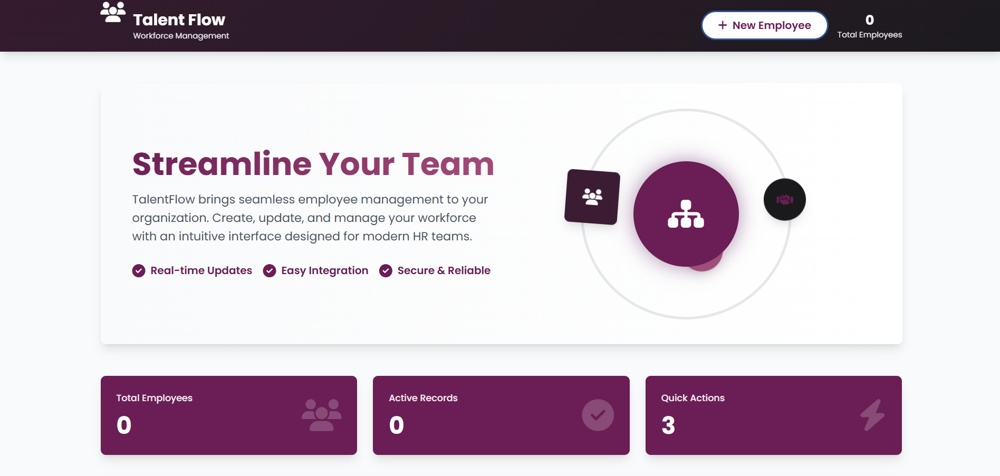

# TalentFlow — Employee Management (Spring Boot + Tailwind)

TalentFlow is a polished full‑stack Employee Management application built to showcase practical end-to-end skills for backend, frontend, and full‑stack roles. It pairs a Spring Boot REST API and MySQL persistence with a responsive, mobile-first frontend using Tailwind CSS and vanilla JavaScript. The UI includes polished animations, accessible modals, toast notifications, and a complete CRUD workflow for managing employee records.

**One-line:** TalentFlow — Full-stack Employee Management (Spring Boot + Tailwind) with responsive UI, animated UX, and complete CRUD.

---

**Key Highlights**

- **Full REST API:** GET/POST/PUT/DELETE employee endpoints implemented with Spring Boot and JPA/Hibernate.
- **Clean architecture:** Layered code with `EmployeeEntity`, `EmployeeRepository`, `EmployeeService`, `EmployeeServiceImpl`, and `EmpController`.
- **Responsive, production-minded UI:** Tailwind CSS-based, mobile-first layout, accessible modals, and responsive table behavior.
- **Polished UX:** Animated gradient header, toast notifications, loading overlays, and confirmation dialogs.
- **Persistence:** MySQL integration with straightforward configuration in `src/main/resources/application.properties`.
- **Developer-friendly:** Minimal setup and clear starter commands included below.

---

**Tech Stack**

- Backend: Java 17, Spring Boot, Spring Data JPA
- Database: MySQL
- Frontend: Tailwind CSS, Font Awesome, Vanilla JavaScript (ES6+)
- Build: Maven (wrapper included)

---

**Quick Start (Local)**

1. Clone the repo:

   ```bash
   git clone <repo-url>
   cd "crud"
   ```

2. Configure MySQL connection in `src/main/resources/application.properties` (database, username, password).

3. Run the application

   - Windows (PowerShell):

     ```powershell
     mvnw.cmd spring-boot:run
     ```

   - Unix / macOS:
     ```bash
     ./mvnw spring-boot:run
     ```

4. Open the app in your browser:

   - `http://localhost:8080`

5. Use the UI to create, edit, search, and delete employee records.

---

**Project Structure**

- **Backend:** `EmpController.java` — REST endpoints (GET/POST/PUT/DELETE); `EmployeeServiceImpl.java` — service layer with transaction management; `EmployeeEntity.java` & `EmployeeRepository` — JPA mapping and data access.
- **Frontend:** `src/main/resources/static/index.html` and `app.js` — responsive UI, client-side validation, state management, loading states, toast notifications, and accessible modals.

---

**Notes**

- Ready for local deployment or demos.
- Can be extended with Docker, CI/CD workflows, or sample datasets as needed.

---

**Author**

- Project by thepranay01 — contact via GitHub profile.

<p align="center">
  
</p>
